## 架构图
### 总体架构图
项目采用前后端分离架构，通过JSON接口实现数据交互
- 后端数据库使用`MySQL`,使用`Sequelize`作为数据库ORM框架。
- 服务器使用`node`的`express`，其中图片上传使用到`busyboy`模块，使用`router`封装了`RESTful`的服务接口，即时信息处理使用了`socket.io`
- 前端使用`Ionic 2`框架，基于`Angular2`和`cordova`开发跨平台的`SPA`
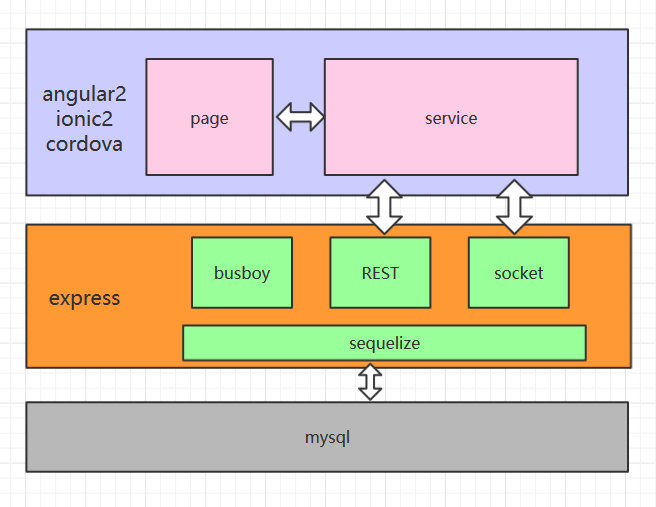

### 前端架构图
前端架构分为`services`和`pages`两部分,`services`负责与后端进行交互并进行业务逻辑处理，`pages`负责根据`services`的数据展示前端页面并处理用户事件将其参数转给`services`
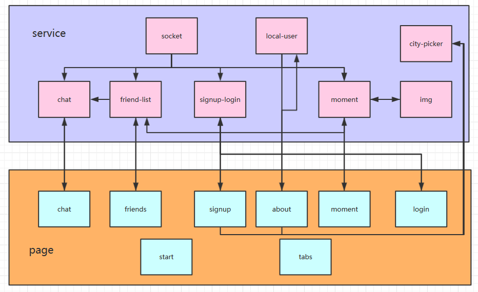

## 流程图
### 发消息流程图

### 发朋友圈流程图
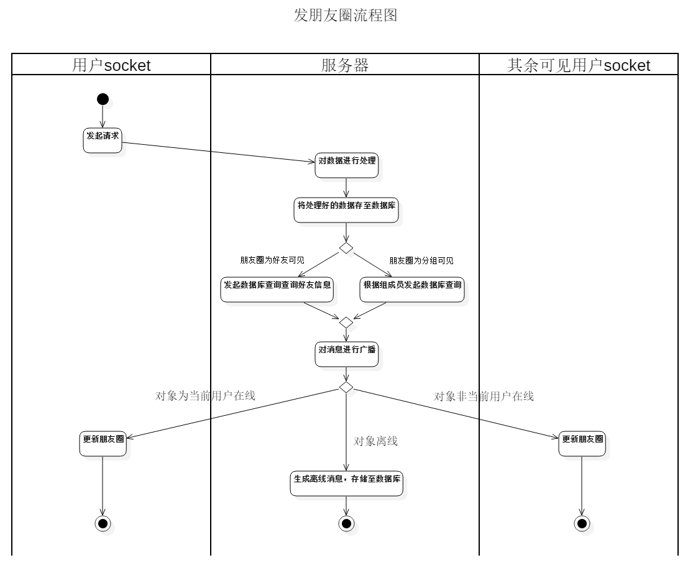

### 发评论流程图
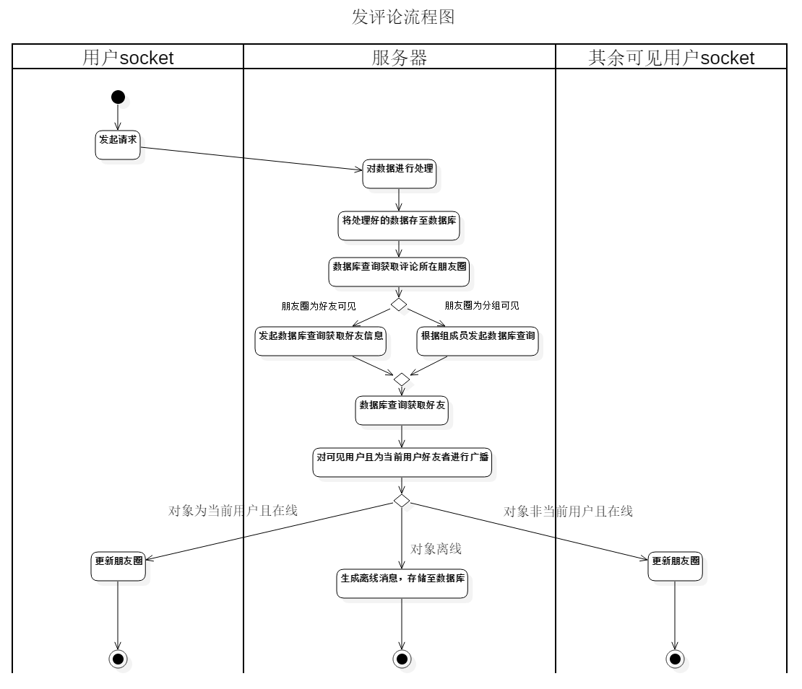

### 好友请求流程图
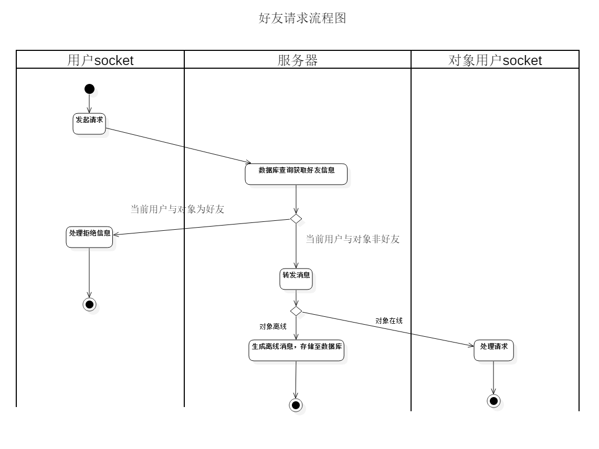

### 同意好友请求流程图
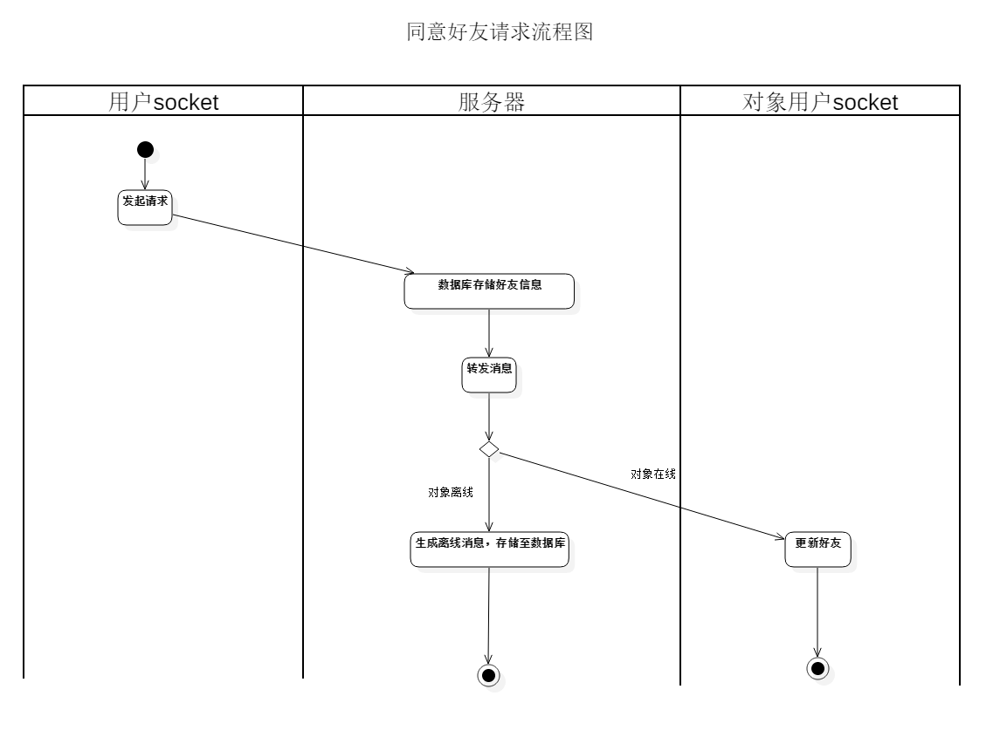

### 点赞流程图
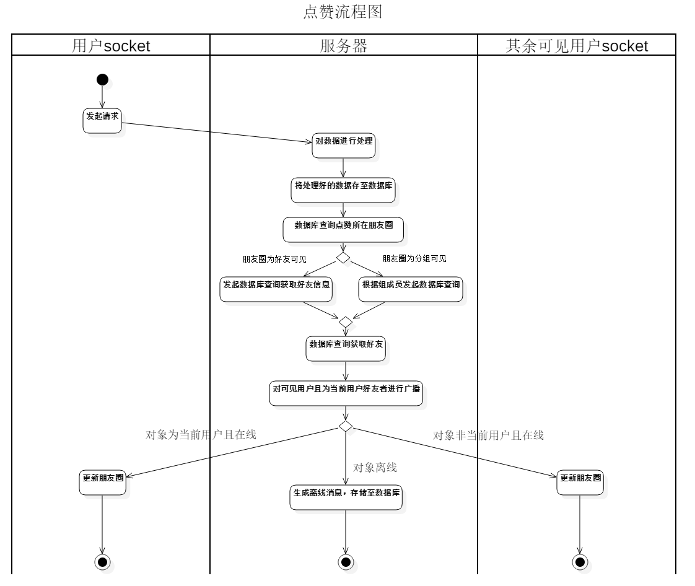

### 登录流程图
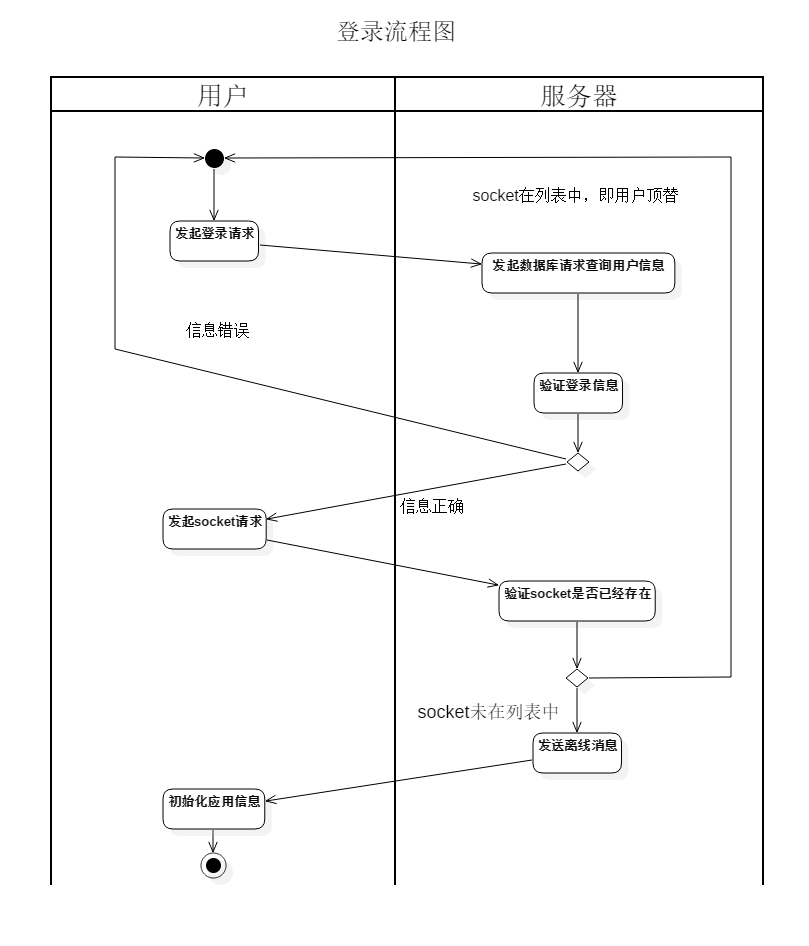

## 用例图
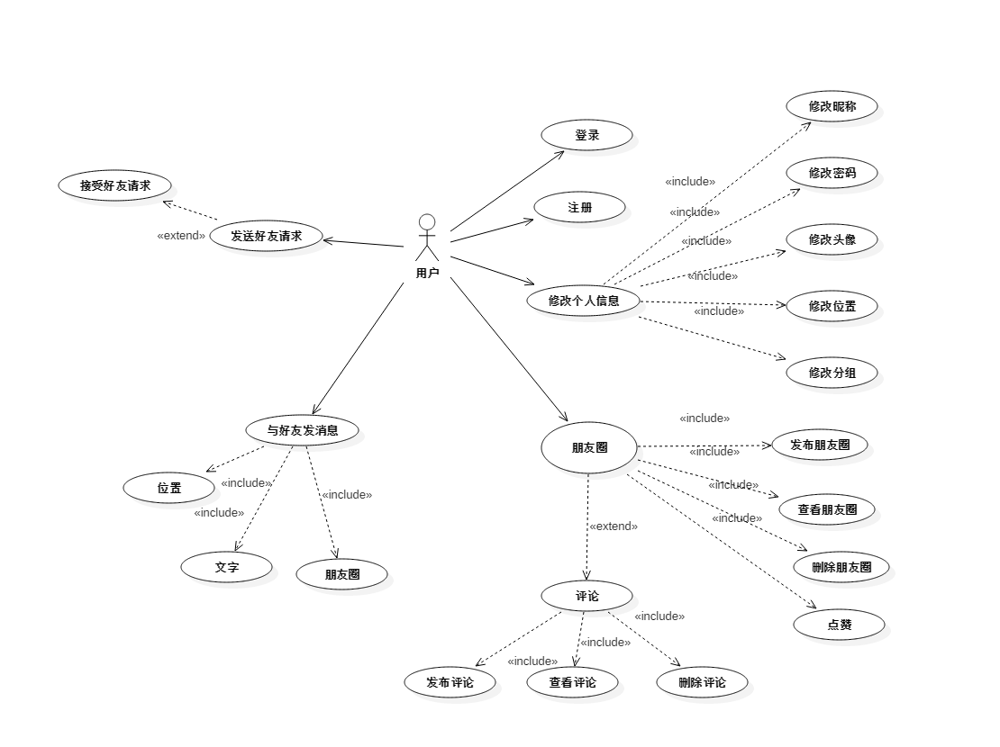

## 类图
### 实体类图
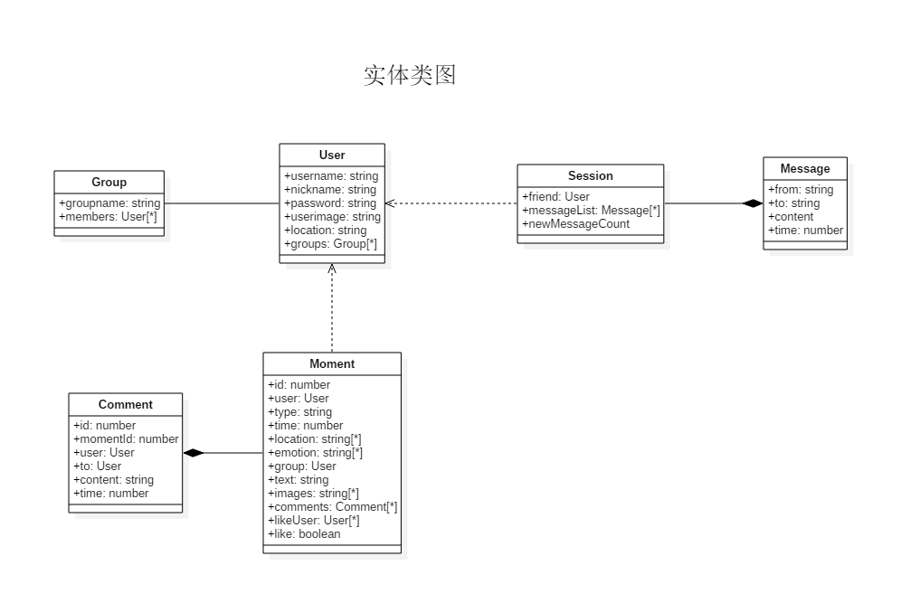

### 服务类图
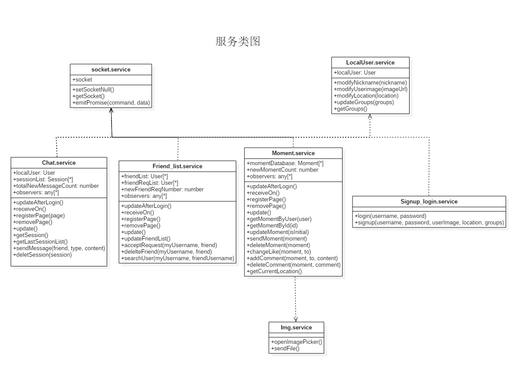

## 数据库
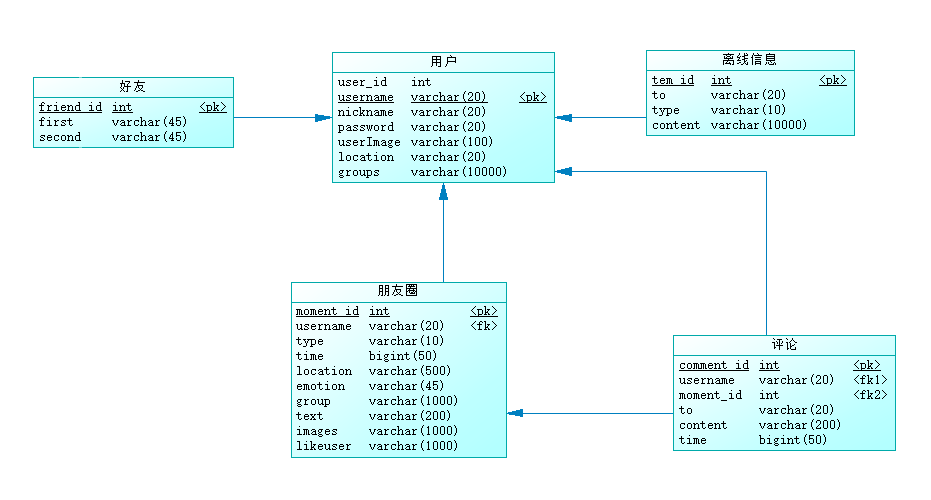
